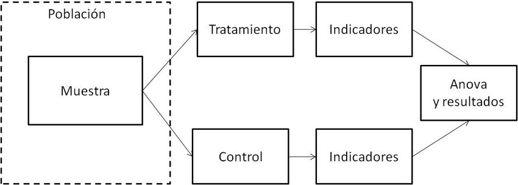
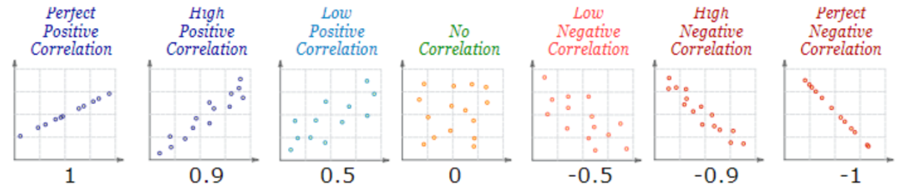

class: inverse, bottom, right

```{r, include=FALSE,echo=FALSE,results='hide'}
#install.packages("pagedown")
#pagedown::chrome_print("segunda_catedra.html",output="segunda_catedra.pdf")
```


```{r setup, include=FALSE, cache = FALSE}
library(ggplot2)
library(dplyr)
require("knitr")
options(htmltools.dir.version = FALSE)
pacman::p_load(RefManageR)
 
```

```{r eval=FALSE, echo=FALSE}
# Correr esta línea para ejecutar
rmarkdown::render('xaringan::moon_reader')
```

<!---
About macros.js: permite escalar las imágenes como [:scale 50%](path to image), hay si que grabar ese archivo js en el directorio.
.pull-left[<images/Conocimiento cívico.png>] 
.pull-right[<images/Conocimiento cívico_graf.png>]

--->

# __Cuarta Clase Métodos Cuantitativos II__
## *Principios de la causalidad y análisis de correlación*
<br>
<hr>


### Docente: Francisco Meneses
### Ayudante: Victoria Arias

<br>

---


class: inverse, middle, center, slideInRight

#  Entre la causalidad y la correlación


---

## Correlación vs. causalidad  

- La correlación **no implica causalidad**.  
- Para hablar de causalidad se requieren **tres condiciones**:

A) **Temporalidad**: La causa es anterior al efecto.  

--

B) **Asociación**: existe relación estadística entre A y B.  

--

C) **No espurias**: no existen otros factores que expliquen la asociación.  


---

## Ejemplos de errores: Problema temporal. 

- **Error de incoherencia temporal**  

  Ejemplo: *Los piojos alejan las enfermedades - Cuando en realidad el tener fiebre aleja los piojos*.  

--

- **Error de falta de Asociación**  

  Ejemplo: *Las vacunas del COVID generan infertilidad - Cuando no existe evidencia de que la gente vacunada con COVID-19 sea menos fértil que la gente no vacunada*.  

--
  
- **Error de variable alternativa (correlación espuria)**  

  Ejemplo: *El aumento de la vacunación ha aumentado los niveles de autismo - Ambas cosas se deben a una expansión de los servicios médicos*.  

  Otros ejemplos: feminismo-violencia, helados-ahogos

---

# El rol de los experimentos 

* Son una evaluación confiable de causalidad

* Son situaciones controladas

* Nos dan seguridad de no espuriedad (por aleatorio)

* Difíciles de aplicar en la practica





---

# En suma...

*  Comprobar causalidad requiere de tres supuestos: temporal, asociación, no espuriedad

*  La correlación no implica causalidad, pero es una condición de ella 

*  Los experimentos son una forma confiable de causalidad, pero poco prácticos en CCSS


---
class: inverse, middle, center, slideInRight

# Cómo medimos la correlación  

---

## El índice de correlación de Pearson  

- Mide la **intensidad y dirección** de la relación lineal entre dos variables.  
- Sus valores están entre -1 y 1.  

**Interpretación: **  
- +1 → relación lineal positiva perfecta.  
- -1 → relación lineal negativa perfecta.  
- 0 → ausencia de relación lineal.  



---
class: inverse, middle, center, slideInRight

# ¿Cuándo usamos la correlación de Pearson?

---

## Condiciones de las variables  

- Ambas variables deben ser **cuantitativas** (numéricas continuas o de intervalo/razón).  

- Relación **lineal** entre las variables.  

- Distribución aproximadamente **normal** de cada variable.  

- Homocedasticidad: la dispersión de los valores debe ser similar a lo largo del rango.  

- No debe haber **outliers extremos** que distorsionen la relación.  

---

## Consideración clave  

- La correlación de Pearson **no establece causalidad**.  

- **No propone dirección temporal**:  

  - No podemos afirmar si A causa B o B causa A.  

  - Solo indica que **ambas se mueven juntas** en cierta medida.  

---

# Lectura del coeficiente r  

A) **Significación**  
- Se contrasta con un test estadístico para evaluar si la correlación es distinta de 0.  

B) **Dirección**  
- El signo (+/-) de r indica si la relación es positiva o negativa.  

C) **Fuerza**  
- |r| cercano a 1 = relación fuerte.  
- |r| cercano a 0 = relación débil.  

> La fuerza nos indica cuanto se ajustan los puntos a la línea, no la pendiente

---

# Ejemplo aplicado (conceptual).  

- Supongamos que obtenemos un coeficiente de correlación de **r = 0.84** con 30 observaciones.  

- El p-valor < 0.001 indica que la correlación es **estadísticamente significativa**.  
- Interpretación: existe una relación positiva fuerte y confiable entre las variables.  

---

# Ejemplo de correlación débil/no significativa  

- En otro estudio, se obtiene un coeficiente de correlación de **r = 0.05** con 30 observaciones.  

- El p-valor = 0.81 → la correlación **no es estadísticamente significativa**.  

- Interpretación: no hay evidencia suficiente para afirmar que exista relación en la población.  


---

# Tabla de referencia sobre magnitud de r  

| Valor de r (absoluto) | Interpretación |
|-----------------------|----------------|
| >0.10                 | Débil          |
| >0.30                 | Moderada |
| >0.50                 | Fuerte |


*(Los puntos de corte son orientativos, no reglas estrictas.)*  


---


```{r echo=FALSE, fig.height=9, fig.width=9, message=FALSE, warning=FALSE}
load("mat_cor_educ.RData")
library("PerformanceAnalytics")

set.seed(123)
muestra <- mat_cor_educ %>% filter(asistencia_2m>70 & asistencia_2m>70) %>% sample_n(100)

chart.Correlation(muestra, histogram=TRUE, pch=19)
```


---

```{r echo=FALSE}
set.seed(123)
x <- rnorm(30, mean=50, sd=10)
y <- 2*x + rnorm(30, mean=0, sd=15)
```


```{r}
# Cálculo de Pearson
cor.test(x, y, method="pearson")

```

---


```{r}

# Visualización
df <- data.frame(x, y)
sjPlot::plot_scatter(df,x,y, fit.line="lm")
```


---

[https://www.guessthecorrelation.com/](https://www.guessthecorrelation.com/)


---


.center[

]
